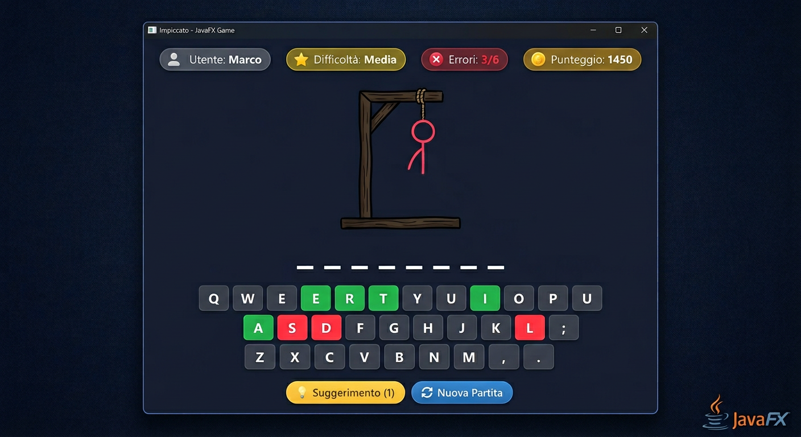
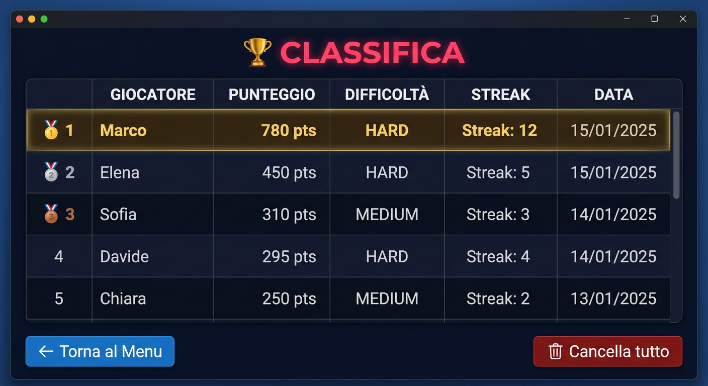

# 🎯 Hangman JavaFX

> **Gioco dell'Impiccato** — Applicazione desktop sviluppata con **Java 21**, **JavaFX 21** e **Maven**.  
> Progetto ispirato agli esempi del repository [nbicocchi/learn-java-javafx](https://github.com/nbicocchi/learn-java-javafx/tree/main/code), con funzionalità estese rispetto alla versione base.

---

## 📸 Screenshots

### Menu Principale


### Schermata di Gioco


### Modalità Multiplayer


### Classifica


---

## 🎮 Funzionalità

### ✅ Funzionalità Base (equivalenti ai progetti di riferimento)
- Gioco dell'Impiccato completo con disegno progressivo del personaggio su `Canvas`
- Tastiera virtuale su schermo + input da tastiera fisica
- Parole in italiano e inglese di varia difficoltà
- Schermata di vittoria / sconfitta con la parola rivelata

### 🆕 Funzionalità Aggiuntive (non presenti nei progetti originali)

#### 1. 🏆 Sistema di Punteggio e Streak
- **Punteggio dinamico** basato su:
  - Difficoltà selezionata (base: 100/200/400 pt)
  - Numero di errori commessi (−20 pt per errore)
  - Uso del suggerimento (−50 pt)
  - Bonus velocità: fino a +120 pt se si indovina in meno di 60 secondi
- **Streak di vittorie consecutive** — mostrata con 🔥 e salvata tra le sessioni
- **Record personale** della streak migliore

#### 2. ⚡ Livelli di Difficoltà
| Livello | Errori massimi | Lunghezza parole | Punti base |
|---------|---------------|-----------------|-----------|
| 😊 Facile | 8 | 3–6 lettere | 100 |
| 😐 Medio | 6 | 5–9 lettere | 200 |
| 😈 Difficile | 4 | 8+ lettere | 400 |

#### 3. 💡 Sistema di Suggerimenti (Hint)
- Pulsante **"💡 Suggerimento"** disponibile una sola volta per partita
- Rivela una lettera casuale non ancora indovinata
- Comporta un malus di −50 punti sul punteggio finale
- Visivamente chiarito all'utente con feedback colorato sulla tastiera

#### 4. 👥 Modalità Multiplayer (2 giocatori, stesso dispositivo)
- Il **Giocatore 1** inserisce la parola segreta per il **Giocatore 2** (campo nascosto `PasswordField`)
- Turni alternati tra le sessioni
- **Scoreboard** condiviso: punti e vittorie di entrambi i giocatori visibili durante la partita
- Possibilità di inserire nomi personalizzati per ciascun giocatore

#### 5. 📊 Classifica Persistente
- I punteggi vengono salvati in `~/.hangman/scores.json` (Gson)
- Top 20 punteggi visualizzati in una `TableView` formattata
- Il primo posto viene evidenziato con una tinta dorata
- Pulsante per cancellare tutti i punteggi

---

## 🏗 Struttura del Progetto

```
hangman-javafx/
├── pom.xml                          # Build Maven + dipendenze
├── README.md
├── docs/
│   └── screenshots/                 # Screenshot per README
└── src/
    └── main/
        ├── java/
        │   └── com/hangman/
        │       ├── app/
        │       │   ├── HangmanApp.java      # Main Application (extends Application)
        │       │   └── Launcher.java       # Entry point fat-jar (non estende Application)
        │       ├── model/
        │       │   ├── Difficulty.java     # Enum livelli di difficoltà
        │       │   ├── GameMode.java       # Enum modalità (single/multi)
        │       │   ├── GameState.java      # Stato completo della partita
        │       │   ├── ScoreEntry.java     # Record punteggio leaderboard
        │       │   └── WordBank.java       # Pool di parole + validazione
        │       ├── controller/
        │       │   ├── MenuController.java         # Controller menu principale
        │       │   ├── MultiSetupController.java   # Controller setup multiplayer
        │       │   ├── GameController.java         # Controller schermata di gioco
        │       │   └── LeaderboardController.java  # Controller classifica
        │       ├── service/
        │       │   └── ScoreService.java   # Persistenza JSON punteggi (Singleton)
        │       └── view/
        │           └── HangmanCanvas.java  # Canvas personalizzato disegno impiccato
        └── resources/
            ├── fxml/
            │   ├── menu.fxml
            │   ├── multi_setup.fxml
            │   ├── game.fxml
            │   └── leaderboard.fxml
            └── css/
                └── style.css            # Dark theme CSS completo
```

---

## 🧱 Architettura e Scelte Progettuali

### Pattern MVC (Model-View-Controller)
Il progetto segue rigorosamente il pattern **MVC** applicato a JavaFX:

| Layer | Classi | Responsabilità |
|-------|--------|----------------|
| **Model** | `GameState`, `Difficulty`, `GameMode`, `WordBank`, `ScoreEntry` | Logica di gioco pura, nessuna dipendenza da JavaFX |
| **View** | File FXML + `HangmanCanvas` + CSS | Presentazione, layout, stile |
| **Controller** | `*Controller.java` | Collegamento tra Model e View, gestione eventi |

### Scelte Tecniche

#### `HangmanCanvas` — Custom Node
Il disegno dell'impiccato è realizzato tramite una classe custom che estende `Canvas`. Il metodo `draw(errors, maxErrors)` scala dinamicamente le parti del corpo in base alla difficoltà, così ogni livello usa tutte le parti disponibili (8 in totale: testa, corpo, 2 braccia, 2 gambe, 2 piedi).

#### `ScoreService` — Singleton + Gson
Il servizio di salvataggio punteggi usa il pattern **Singleton** per garantire una singola istanza. La serializzazione è delegata a **Gson**, che converte automaticamente le liste di `ScoreEntry` in JSON. I file vengono salvati in `~/.hangman/` per essere indipendenti dalla posizione del JAR.

#### `Launcher` — Fat-JAR workaround
JavaFX richiede che la classe che chiama `launch()` **non estenda `Application`** quando viene eseguita da un fat-jar (shadow jar). Per questo motivo esiste `Launcher.java`, che funge da entry point e delega l'avvio a `HangmanApp`.

#### Navigazione tra schermate
Invece di aprire nuove `Stage`, il progetto usa un approccio **scene-switching**: `HangmanApp.switchScene()` e `switchSceneAndGetController()` sostituiscono la `Scene` della finestra principale. Questo garantisce un'esperienza fluida e un'unica finestra.

#### FXML + CSS
Ogni schermata è definita in un file FXML separato, tenendo la struttura visiva separata dalla logica. Il tema dark è definito interamente in `style.css` con variabili di colore coerenti.

---

## 🚀 Come eseguire il progetto

### Prerequisiti
- **Java 21** (JDK) — [Scarica da Adoptium](https://adoptium.net/)
- **Maven 3.8+** — [Scarica da Apache](https://maven.apache.org/)

### Verifica versioni
```bash
java -version   # deve mostrare 21+
mvn -version    # deve mostrare 3.8+
```

### Avvio rapido con Maven
```bash
# Entra nella cartella del progetto
cd hangman-javafx

# Avvia direttamente con il plugin JavaFX
mvn javafx:run
```

### Build e JAR eseguibile
```bash
# Compila e crea il fat-jar
mvn clean package

# Esegui il fat-jar (non richiede Maven installato sul PC di destinazione)
java -jar target/hangman-javafx-1.0.0-fat.jar
```

> **Nota**: il fat-jar include JavaFX e tutte le dipendenze, ma richiede **Java 21** installato sul sistema.

---

## 📦 Dipendenze Maven

```xml
<!-- JavaFX 21 -->
<dependency>
    <groupId>org.openjfx</groupId>
    <artifactId>javafx-controls</artifactId>
    <version>21.0.2</version>
</dependency>
<dependency>
    <groupId>org.openjfx</groupId>
    <artifactId>javafx-fxml</artifactId>
    <version>21.0.2</version>
</dependency>

<!-- Gson per serializzazione JSON dei punteggi -->
<dependency>
    <groupId>com.google.code.gson</groupId>
    <artifactId>gson</artifactId>
    <version>2.10.1</version>
</dependency>
```

**Plugin usati:**
- `javafx-maven-plugin 0.0.8` — per `mvn javafx:run`
- `maven-compiler-plugin 3.11.0` — compilazione Java 21
- `maven-shade-plugin 3.5.1` — fat-jar eseguibile

---

## 🎯 Come si Gioca

### Giocatore Singolo
1. Seleziona la **difficoltà** (Facile/Medio/Difficile)
2. Inserisci il tuo nome (opzionale)
3. Premi **GIOCA**
4. Indovina la parola cliccando sui tasti o usando la tastiera fisica
5. Hai a disposizione **1 suggerimento** per partita (pulsante 💡)
6. Vinci indovinando la parola, perdi se superi il numero massimo di errori

### Modalità Due Giocatori
1. Seleziona **"👥 Due Giocatori"**
2. Inserisci i nomi di entrambi i giocatori
3. Il **Giocatore 1** inserisce una parola segreta (campo nascosto) per il **Giocatore 2**
4. Il Giocatore 2 gioca normalmente cercando di indovinarla
5. Al termine si può fare un altro round con i ruoli invertiti
6. Il **scoreboard** mostra punti e vittorie di entrambi in tempo reale

---

## 👨‍💻 Sviluppato con AI-Assisted Coding

Questo progetto è stato sviluppato con l'ausilio di strumenti di **AI-assisted coding**, come richiesto dai requisiti del progetto. L'AI è stata utilizzata per:
- Generazione della struttura base del progetto
- Implementazione della logica di gioco
- Design del tema grafico CSS
- Documentazione e README

Il codice è stato revisionato, compreso e può essere discusso e spiegato in ogni sua parte.

---

## 📝 Note Aggiuntive

- I punteggi vengono salvati localmente in `~/.hangman/scores.json`
- Il gioco supporta parole in **italiano** e **inglese**
- La tastiera fisica funziona sempre durante il gioco (basta che la finestra sia in focus)
- La streak viene **resettata** a ogni sconfitta in modalità singolo giocatore
- In modalità multiplayer i punteggi sono separati e mostrati entrambi in tempo reale

---

*Progetto per il corso di Programmazione ad Oggetti — Università di Modena e Reggio Emilia*
