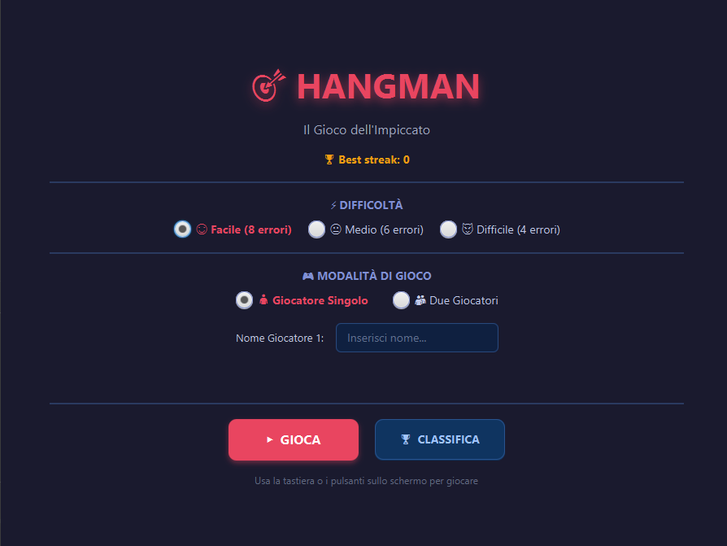
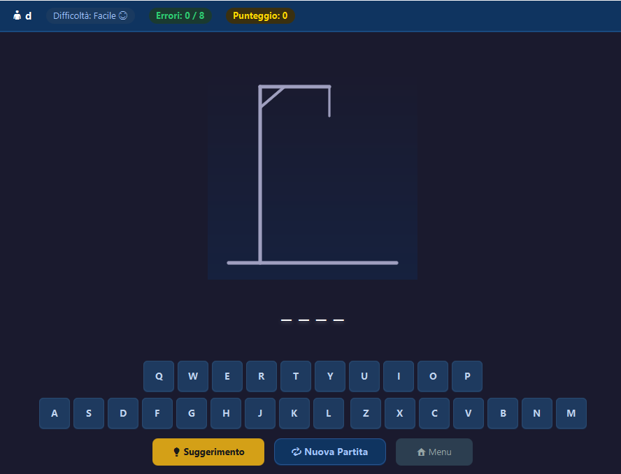
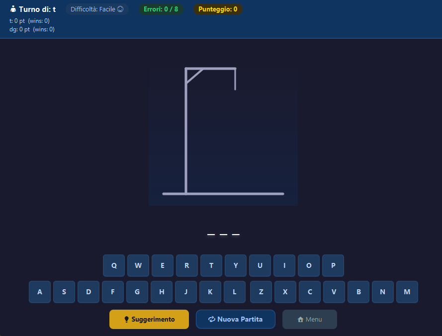
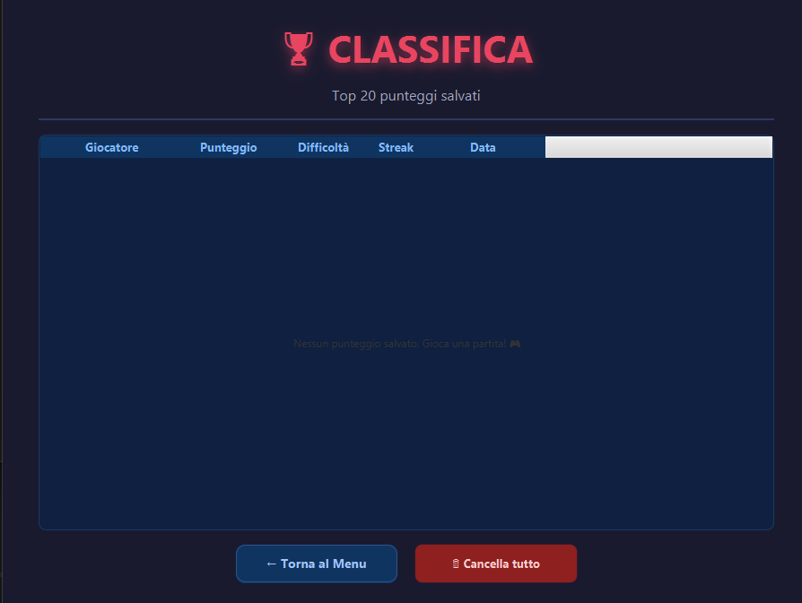

# 🎯 Hangman JavaFX

> **Gioco dell'Impiccato** 
---

## 🎮 Funzionalità

### ✅ Funzionalità Base 
- Gioco dell'Impiccato completo con disegno progressivo del personaggio 
- Tastiera virtuale su schermo + input da tastiera fisica
- Schermata di vittoria / sconfitta con la parola rivelata

### 🆕 Funzionalità Aggiuntive 

#### 1. 🏆 Sistema di Punteggio e Streak
- **Punteggio dinamico** basato su:
  - Difficoltà selezionata (base: 100/200/400 pt)
  - Numero di errori commessi (−20 pt per errore)
  - Uso del suggerimento (−50 pt)
  - Bonus velocità: fino a +120 pt se si indovina in meno di 60 secondi
- **Streak di vittorie consecutive** — mostrata con 🔥 e salvata tra le sessioni
- **Record personale** della streak migliore

#### 2. ⚡ Livelli di Difficoltà
| Livello | Errori massimi | Lunghezza parole | Punti base |
|---------|---------------|-----------------|-----------|
| 😊 Facile | 8 | 3–6 lettere | 100 |
| 😐 Medio | 6 | 5–9 lettere | 200 |
| 😈 Difficile | 4 | 8+ lettere | 400 |

#### 3. 💡 Sistema di Suggerimenti (Hint)
- Pulsante **"💡 Suggerimento"** disponibile una sola volta per partita
- Rivela una lettera casuale non ancora indovinata
- Comporta un malus di −50 punti sul punteggio finale
- Visivamente chiarito all'utente con feedback colorato sulla tastiera

#### 4. 👥 Modalità Multiplayer (2 giocatori, stesso dispositivo)
- Il **Giocatore 1** inserisce la parola segreta per il **Giocatore 2** (campo nascosto `PasswordField`)
- Turni alternati tra le sessioni
- **Scoreboard** condiviso: punti e vittorie di entrambi i giocatori visibili durante la partita
- Possibilità di inserire nomi personalizzati per ciascun giocatore

#### 5. 📊 Classifica Persistente
- I punteggi vengono salvati in `~/.hangman/scores.json` 
- Top 20 punteggi visualizzati in una `TableView` formattata
- Il primo posto viene evidenziato con una tinta dorata
- Pulsante per cancellare tutti i punteggi

---

## 📸 Screenshots

### Menu Principale


### Schermata di Gioco


### Modalità Multiplayer


### Classifica


---

## 🏗 Struttura del Progetto

```
hangman-javafx/
├── pom.xml                          # Build Maven + dipendenze
├── README.md
├── docs/
│   └── screenshots/                 # Screenshot per README
└── src/
    └── main/
        ├── java/
        │   └── com/hangman/
        │       ├── app/
        │       │   ├── HangmanApp.java      # Main Application (extends Application)
        │       │   └── Launcher.java       # Entry point fat-jar (non estende Application)
        │       ├── model/
        │       │   ├── Difficulty.java     # Enum livelli di difficoltà
        │       │   ├── GameMode.java       # Enum modalità (single/multi)
        │       │   ├── GameState.java      # Stato completo della partita
        │       │   ├── ScoreEntry.java     # Record punteggio leaderboard
        │       │   └── WordBank.java       # Pool di parole + validazione
        │       ├── controller/
        │       │   ├── MenuController.java         # Controller menu principale
        │       │   ├── MultiSetupController.java   # Controller setup multiplayer
        │       │   ├── GameController.java         # Controller schermata di gioco
        │       │   └── LeaderboardController.java  # Controller classifica
        │       ├── service/
        │       │   └── ScoreService.java   # Persistenza JSON punteggi (Singleton)
        │       └── view/
        │           └── HangmanCanvas.java  # Canvas personalizzato disegno impiccato
        └── resources/
            ├── fxml/
            │   ├── menu.fxml
            │   ├── multi_setup.fxml
            │   ├── game.fxml
            │   └── leaderboard.fxml
            └── css/
                └── style.css            # Dark theme CSS completo
```


## 🎯 Come si Gioca

### Giocatore Singolo
1. Seleziona la **difficoltà** (Facile/Medio/Difficile)
2. Inserisci il tuo nome (opzionale)
3. Premi **GIOCA**
4. Indovina la parola cliccando sui tasti o usando la tastiera fisica
5. Hai a disposizione **1 suggerimento** per partita (pulsante 💡)
6. Vinci indovinando la parola, perdi se superi il numero massimo di errori

### Modalità Due Giocatori
1. Seleziona **"👥 Due Giocatori"**
2. Inserisci i nomi di entrambi i giocatori
3. Il **Giocatore 1** inserisce una parola segreta (campo nascosto) per il **Giocatore 2**
4. Il Giocatore 2 gioca normalmente cercando di indovinarla
5. Al termine si può fare un altro round con i ruoli invertiti
6. Il **scoreboard** mostra punti e vittorie di entrambi in tempo reale
   
---

*Progetto per il corso di Programmazione ad Oggetti — Università di Modena e Reggio Emilia*
